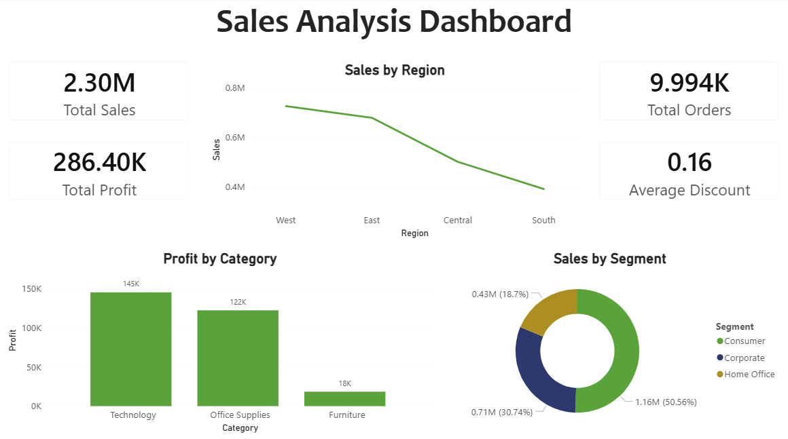
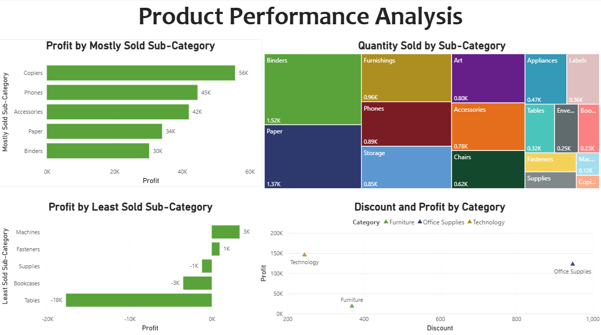
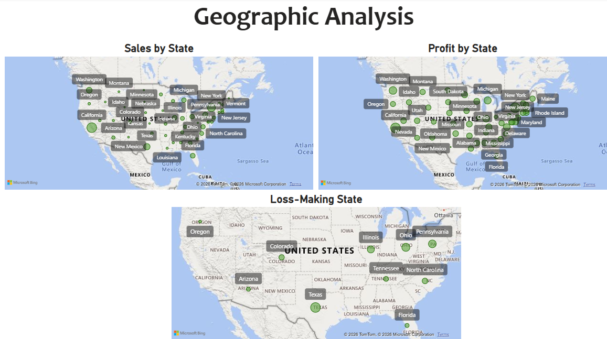

# Sales Analysis Dashboard

## Project Overview
This project focuses on analyzing sales, profitability, customer segments, product performance, and regional trends using SQL and Power BI. The objective was to generate meaningful business insights and build an interactive dashboard to support data-driven decision-making.

---

## Tools & Technologies Used
- SQL
- Power BI
- Excel
- Data Visualization
- Business Analytics

---

## Project Objectives
- Analyze sales and profit performance
- Identify high-performing and loss-making regions
- Evaluate product category profitability
- Understand customer segment contribution
- Analyze the impact of discounts on profit

---

## SQL Analysis Performed
The following analyses were performed using SQL:

- Total Sales & Profit Analysis
- Regional Sales & Profit Analysis
- Top Selling Categories
- Most & Least Profitable Sub-Categories
- Customer Segment Analysis
- Discount Impact on Profit
- State-wise Sales & Loss Analysis
- Product Quantity Analysis

---

## Dashboard Features

### Executive Dashboard
- Total Sales KPI
- Total Profit KPI
- Total Orders KPI
- Average Discount KPI
- Sales by Region
- Profit by Category
- Sales by Segment

### Product Performance Dashboard
- Top Profitable Sub-Categories
- Least Profitable Sub-Categories
- Quantity Sold Analysis
- Discount vs Profit Analysis

### Geographic Analysis Dashboard
- Sales by State
- Profit by State
- Loss-Making States

---

## Dashboard Preview

### Executive Dashboard

### Product Performance Analysis

### Geographic Analysis

---

## Key Business Insights

- West region generated the highest sales among all regions.
- Technology category produced the highest profits.
- Furniture category showed comparatively lower profitability.
- Consumer segment contributed the highest revenue share.
- Higher discounts negatively impacted profitability.
- Certain states consistently generated losses despite sales activity.
- Product-level analysis identified both high-performing and underperforming sub-categories.

---

## Conclusion
This project demonstrates how SQL and Power BI can be used together to perform business analysis and create interactive dashboards for decision-making. The analysis helps identify growth opportunities, operational inefficiencies, and profitability trends.

---

## Skills Demonstrated
- SQL Querying
- Data Cleaning
- Data Visualization
- Dashboard Development
- Business Insight Generation
- KPI Analysis
- Analytical Thinking

---

## Project Files
- SQL Queries
- Power BI Dashboard (.pbix)
- Dataset
- Dashboard Screenshots

---

## Author
Kirti Patidar
Aspiring Data Analyst | Business Analytics Enthusiast
